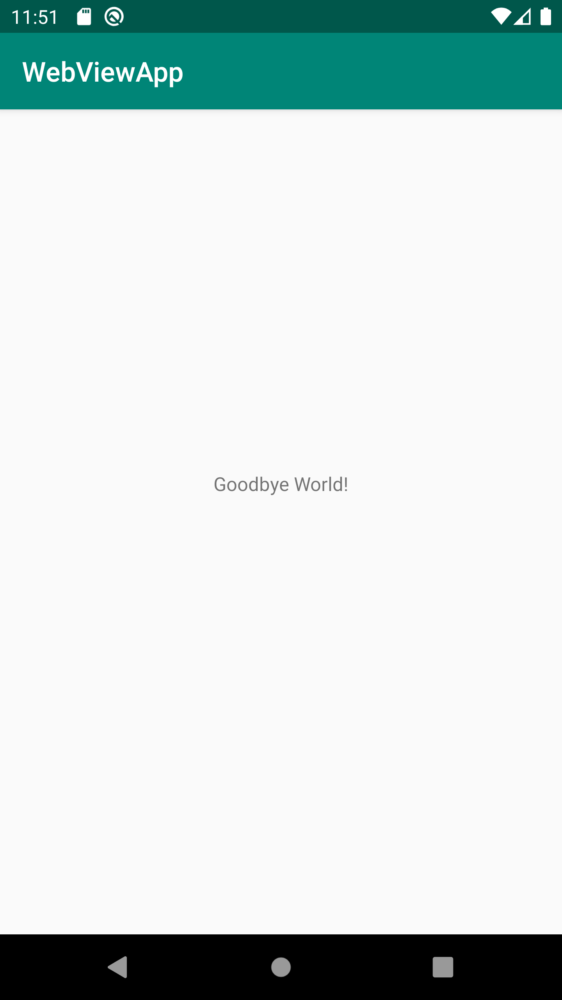

# Rapport

Jag gick till `content_main`, gick in i codeview och ändrade textsträngen till "Goodbye World!",
sedan använde jag android studios meny för att göra om det till en reference resurs namngiven
`Text_Resources`

